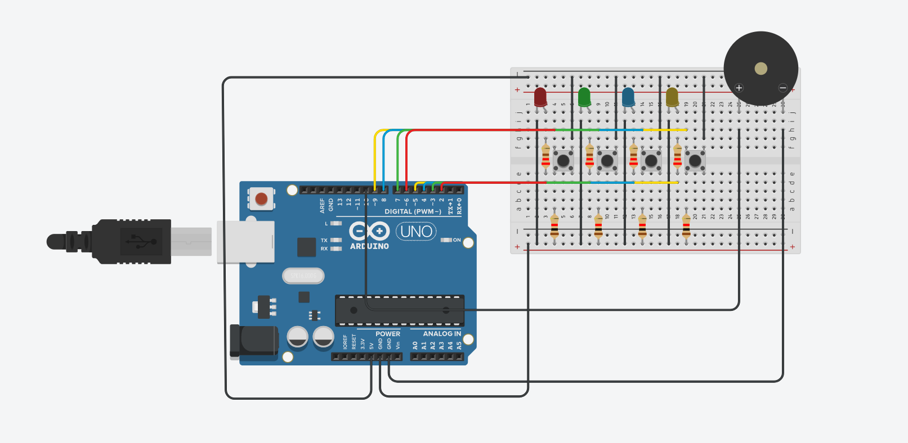

# 💣 Bomb Defuse Game (Arduino Project)

A fun and intense **Arduino-based Bomb Diffusing Game** 🎮  
Observe the LEDs, remember the blinking pattern, and cut (press) the correct wire before time runs out!

---

## ⚡ Overview

This project simulates a **bomb defusal challenge** using LEDs, buttons, and a buzzer.  
Your task is simple yet nerve-racking:
> Identify which LED blinked the most and press its corresponding button within 5 seconds — or face the *boom!* 💥

---

## 🧠 Game Logic

1. **Game starts** — LEDs blink randomly.  
2. **Count carefully** — One LED blinks more times than others.  
3. **Act fast** — Press the button linked to that LED within 5 seconds.  
4. **Outcome**:
   - ✅ **Correct choice** → Victory tone plays  
   - ❌ **Wrong choice / Timeout** → Failure tone (boom sound)

---

## 🧩 Circuit Diagram

Below is the full setup made using **Arduino UNO**, LEDs, push buttons, resistors, and a buzzer:

---

## ⚙️ Hardware Requirements

| Component | Quantity | Description |
|------------|-----------|-------------|
| Arduino UNO / Nano | 1 | Main microcontroller |
| LEDs | 4 | Represent different wires |
| 220Ω Resistors | 4 | For current limiting |
| Push Buttons | 4 | To select (cut) the wire |
| Buzzer | 1 | For alert tones |
| Breadboard & Jumper Wires | - | For connections |

---

## 🔌 Pin Connections

| Component | Arduino Pin | Mode |
|------------|--------------|------|
| LED 1–4 | 2, 3, 4, 5 | OUTPUT |
| Button Inputs | 6, 7, 8, 9 | INPUT_PULLUP |
| Buzzer | 10 | OUTPUT |

---

## 💾 Code Explanation

| Function | Purpose |
|-----------|----------|
| `blinkLED(index)` | Randomly blinks a given LED |
| `checkAnswer(index)` | Verifies player’s chosen LED |
| `playSuccessTone()` | Plays success beep sequence |
| `playFailTone()` | Plays failure (explosion) tone |
| `loop()` | Controls the main game logic and timing |

---

## 🎵 Sound Effects

| Event | Tone |
|--------|------|
| ✅ Success | Rising dual beep (1000Hz → 1500Hz) |
| ❌ Failure | Alternating low tones (400Hz ↔ 200Hz × 3) |

---

## 🕹️ How to Play

1. Connect all components as per the circuit diagram.  
2. Upload the provided Arduino code.  
3. Open Serial Monitor to see game messages.  
4. Watch the blinking LEDs carefully.  
5. Press the button of the LED that blinked most frequently.  
6. Listen for the buzzer result — you either win or blow up! 😄  

---
